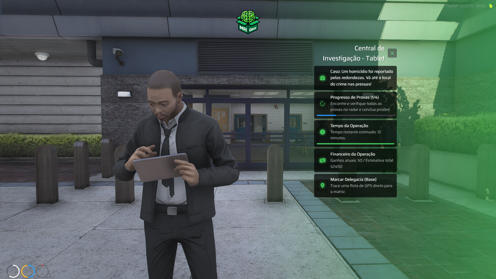
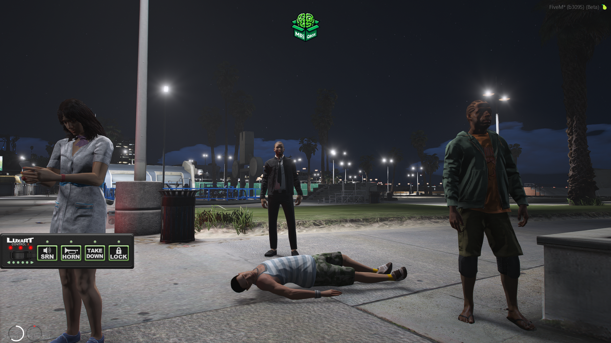
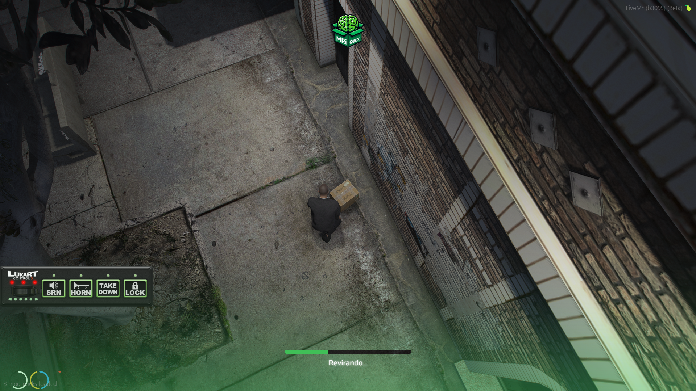

# Lopestorm Detective (QBX/QBCore)

Bem-vindo ao **Lopestorm Detective**, um sistema imersivo de investigação criminal estilo ARG (Alternate Reality Game) para servidores baseados em Qbox/QBCore. Desenvolvido com foco profundo no *Roleplay* policial, o script leva seus detetives às ruas para rastrear corpos, analisar evidências, hackear sistemas de rádio em furgões e realizar prisões arriscadas gerenciadas por inteligência econômica dinâmica.

---

## Funcionalidades Principais

* **11 Casos Únicos**: Precedentes ricos cobrindo de assassinatos rurais em Paleto Bay a mafiosos atuantes do lado de fora do Diamond Casino. Cada caso é selecionado aleatoriamente e contém uma trilha única de objetos, NPCs e Hackings.
* **Economia Escalonável**: Paga os investigadores etapa por etapa, para que não saiam de mãos vazias caso sejam abatidos durante uma operação (os valores e bônus aplicam variações randomizadas estéticas entre ±50% para inibir farme "tabelado").
* **Tablet de Investigação Holográfico**: Uma interface embutida diretamente como item (Dossiê Eletrônico). Mostra a barra de progressos das provas achadas e o tempo restante do crime, com *UI colors* responsivas. E sim, para evitar lixo acumulativo na cidade, ele expira e deleta-se sozinho da bolsa do usuário em 30 minutos em tempo real!
* **Ação Contra o Relógio**: Esqueça investigações mornas. A mídia de Los Santos joga pesado. O jogador possui minutos cronometrados (distribuídos inteligentemente por conta da rota do waypoint) para prender o criminoso antes que o chefe encerre sua missão. Rádios de rádio-patrulha vibram alertas temporizados para segurar o clima tenso.
* **Isolamento de Erro Memory-Pool**: O recurso suporta de forma robusta limitações do GTA V. Se sua viatura falhar a renderizar numa rua conturbada, o script salva as *threads*, previne *client crash*, e continua executando o roteiro para você ir andando à cena do crime sem falir o State. 

---

## Imagens e Demonstração

O script interage dinamicamente com as mecânicas policiais da sua base, permitindo total profundidade do Roleplay em campo:

### Interface e Equipamento


### Cenas de Crime e Coleta




### Descoberta e Extração


---

## Instalação (Deploy Server)

1. Adicione a pasta `lopestorm-detective` na sua pasta central de recursos (ex: `resources/[outros]/lopestorm-detective`).
2. Garanta que você está usando as bases compatíveis em sua cidade (Qualquer release QBCore nativo ou QBOX).
3. Insira e configure o item `tablet_detetive` na base de dados de seu inventário (`ox_inventory`). 
```lua
    "tablet_detetive": {
        "name": "tablet_detetive",
        "label": "Tablet de Investigação",
        "weight": 1000,
        "degrade": 30
    }
```
4. Adicione na linha final do seu `server.cfg`:
```bash
ensure lopestorm-detective
```

---

## Configurações Exclusivas (`config.lua`)

Todo o controle está nas suas mãos. Entre no `config.lua` e navegue por:

* **Configurações de Facção**: `Config.RequireJob` diz se qualquer um ou se APENAS policiais podem puxar a missão.
* **Veículo Padrão**: Por padrão, puxamos o `police4`. Altere para ID de addon ou outras viaturas descaracterizadas disponíveis para Detetives em sua base.
* **Os Casos**: Cada um traz `MinutesToResolve` e `StoryTelling`. Adapte o tempo de viatura que o usuário gasta até a cena.
* **Modo Debug**: `Config.Debug = true`.

### Tratamento de Bugs Internos (Comandos In-Game)
Para ajudar a checar locais de spawn e mapeamento na edição do mod, a opção *Debug* libera dois comandos ocultos vitais:

* `/debugcasos`: Força imediatamente o motor a dropar fisicamente todas as evidências, vítimas, carros blindados e peds criminosos espalhados pelas pontas do estado do mapa simuladamente do Caso 1 ao 11, *ignorando restrições de tempo*.
* `/limpardebug`: Apaga todas as entidades massivas de uma vez limpando seus loops e *network variables*.

---
_Criado, Refinado e Distribuído por **Lopestorm**_
