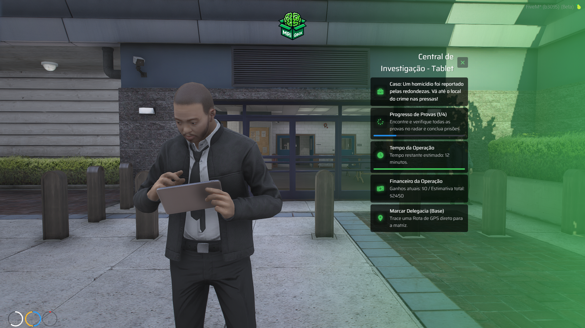
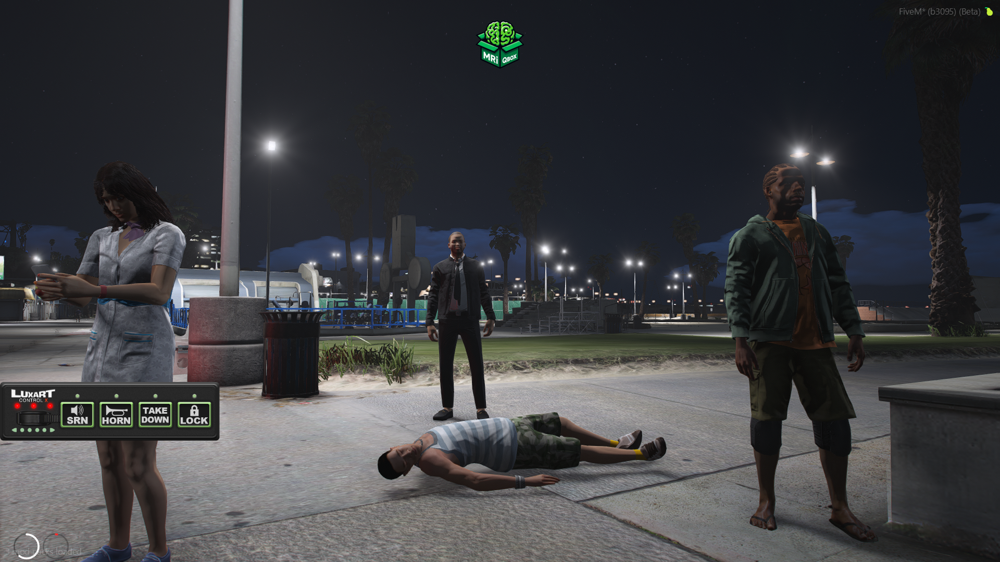
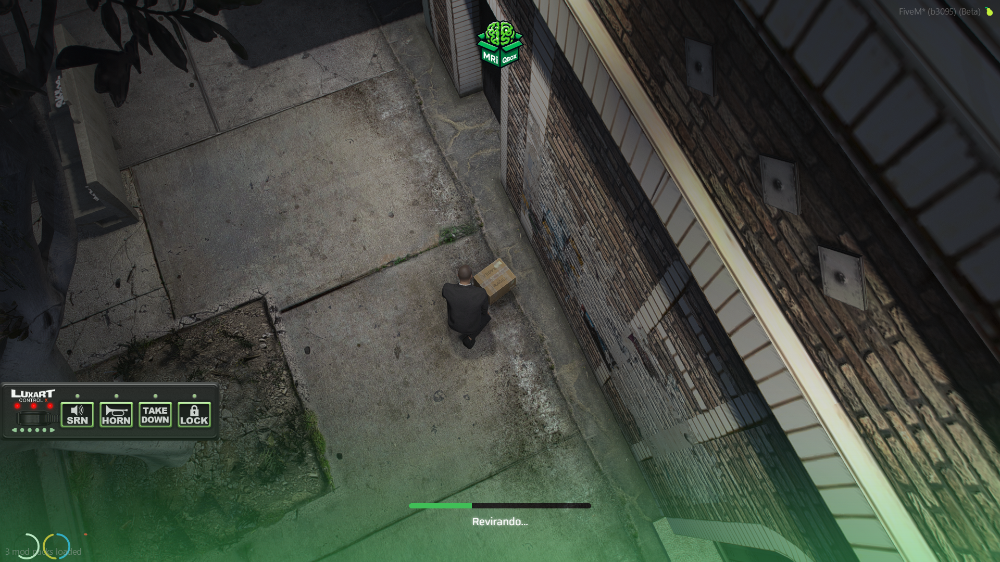

# Lopestorm Detective (QBX/QBCore)

Bem-vindo ao **Lopestorm Detective**, um sistema imersivo de investigação criminal estilo ARG (Alternate Reality Game) para servidores baseados em Qbox/QBCore. Desenvolvido com foco profundo no *Roleplay* policial, o script leva seus detetives às ruas para rastrear corpos, analisar evidências, hackear sistemas de rádio em furgões e realizar prisões arriscadas gerenciadas por inteligência econômica dinâmica.

---

## Funcionalidades Principais

* **11 Casos Únicos**: Precedentes ricos cobrindo de assassinatos rurais em Paleto Bay a mafiosos atuantes do lado de fora do Diamond Casino. Cada caso é selecionado aleatoriamente entre os que **não** estão sendo investigados por outro detetive no momento (veja "Trava de Casos" abaixo).
* **Economia Escalonável**: Paga os investigadores etapa por etapa, para que não saiam de mãos vazias caso sejam abatidos durante uma operação (os valores e bônus aplicam variações randomizadas estéticas entre ±50% para inibir farme "tabelado").
* **Tablet de Investigação Holográfico**: Uma interface embutida diretamente como item (Dossiê Eletrônico). Mostra a barra de progressos das provas achadas e o tempo restante do crime, com *UI colors* responsivas. E sim, para evitar lixo acumulativo na cidade, ele expira e deleta-se sozinho da bolsa do usuário em 30 minutos em tempo real!
* **Ação Contra o Relógio**: Esqueça investigações mornas. A mídia de Los Santos joga pesado. O jogador possui minutos cronometrados (distribuídos inteligentemente por conta da rota do waypoint) para prender o criminoso antes que o chefe encerre sua missão. Rádios de rádio-patrulha vibram alertas temporizados para segurar o clima tenso.
* **Isolamento de Erro Memory-Pool**: O recurso suporta de forma robusta limitações do GTA V. Se sua viatura falhar a renderizar numa rua conturbada, o script salva as *threads*, previne *client crash*, e continua executando o roteiro para você ir andando à cena do crime sem falir o State.

### Novo na v2

* **Item Auto-Verificado**: O item do tablet agora tem uma definição única em `shared/items.lua`. No boot, o resource confere sozinho se ele existe no seu `ox_inventory` e, se não existir, avisa **alto e claro no console do servidor** com o trecho exato pra copiar — em vez de falhar em silêncio na hora que um jogador aceita o trabalho.
* **Trava de Casos (multi-detetive)**: se dois detetives aceitarem trabalho ao mesmo tempo, o servidor nunca mais sorteia o mesmo caso pros dois — cada caso fica "travado" pro detetive que o pegou até ele terminar, cancelar ou o tempo esgotar.
* **Cooldown entre Missões**: `Config.MissionCooldown` (padrão 5 minutos) evita que o mesmo jogador engate um caso atrás do outro sem sair da DP.
* **Limpeza à Prova de Queda de Conexão**: se o jogador cair no meio de um caso, o servidor detecta (`playerDropped`), libera o caso pra outro detetive, devolve a chave temporária e apaga a viatura sozinho — mesmo sem o client por perto. Antes, viatura e NPCs órfãos só sumiam num restart do servidor.
* **Nomes de Exports Configuráveis**: sistema de chaves (`Config.CarKeysResource`) e de combustível (`Config.FuelResources`) agora são configuráveis, em vez de hardcoded no client.

---

## Imagens e Demonstração

O script interage dinamicamente com as mecânicas policiais da sua base, permitindo total profundidade do Roleplay em campo:

### Interface e Equipamento


### Cenas de Crime e Coleta




### Descoberta e Extração


---

## Instalação (Deploy Server)

1. Adicione a pasta `lopestorm-detective` na sua pasta central de recursos (ex: `resources/[outros]/lopestorm-detective`).
2. Garanta que você está usando as bases compatíveis em sua cidade (QBCore nativo ou Qbox, com `ox_inventory` e `mri_Qcarkeys`/`mm_carkeys`-compatível).
3. Adicione na linha final do seu `server.cfg` (depois de `ox_lib`, `ox_inventory` e do seu sistema de chaves):
```bash
ensure lopestorm-detective
```
4. Suba o servidor. O resource confere sozinho, no boot, se o item do tablet já existe no seu `ox_inventory`. Se **não** existir, o console mostra um aviso vermelho pedindo pra você copiar o conteúdo de `shared/items.lua` pra dentro de `ox_inventory/data/items.lua`:
```lua
["tablet_detetive"] = {
    label = "Tablet de Investigação",
    weight = 1000,
    stack = false,
    close = true,
    decay = true,
    degrade = 30, -- minutos (tempo de jogo) até o item sumir sozinho se não for usado
    description = "Dossiê eletrônico da central de investigação. Expira sozinho se ficar muito tempo sem uso.",
    client = { image = "tablet_detetive.png" },
},
```
   Depois de colar, dê `restart ox_inventory`. Esse passo continua manual porque o `ox_inventory` não expõe um jeito de outro resource registrar itens em tempo de execução — mas agora você não precisa adivinhar os campos nem descobrir isso só quando um jogador reclamar que não recebeu o tablet.

---

## Configurações Exclusivas (`config.lua`)

Todo o controle está nas suas mãos. Entre no `config.lua` e navegue por:

* **Configurações de Facção**: `Config.RequireJob` diz se qualquer um ou se APENAS policiais podem puxar a missão.
* **Veículo Padrão**: Por padrão, puxamos o `police4`. Altere para ID de addon ou outras viaturas descaracterizadas disponíveis para Detetives em sua base.
* **Os Casos**: Cada um traz `MinutesToResolve` e `StoryTelling`. Adapte o tempo de viatura que o usuário gasta até a cena.
* **Item**: `Config.Item` é o nome do item do tablet — se você trocar aqui, lembre de trocar a chave correspondente em `shared/items.lua` e no `ox_inventory`.
* **Cooldown**: `Config.MissionCooldown` (minutos) entre o fim/cancelamento de um caso e o início do próximo, por jogador.
* **Sistema de Chaves**: `Config.CarKeysResource` é o nome do resource usado pra dar/tirar a chave temporária da viatura (precisa expor os exports `GiveTempKeys`/`RemoveTempKeys` no client e no server, como o `mri_Qcarkeys`).
* **Combustível**: `Config.FuelResources` é a lista de resources de fuel testados via `pcall` ao reabastecer a viatura de trabalho.
* **Modo Debug**: `Config.Debug = true` — com `false` (padrão), os comandos abaixo nem são registrados no servidor.

### Tratamento de Bugs Internos (Comandos In-Game)
Para ajudar a checar locais de spawn e mapeamento na edição do mod, a opção *Debug* libera dois comandos ocultos vitais:

* `/debugcasos`: Força imediatamente o motor a dropar fisicamente todas as evidências, vítimas, carros blindados e peds criminosos espalhados pelas pontas do estado do mapa simuladamente do Caso 1 ao 11, *ignorando restrições de tempo*.
* `/limpardebug`: Apaga todas as entidades massivas de uma vez limpando seus loops e *network variables*.

---
_Criado, Refinado e Distribuído por **Lopestorm**_
